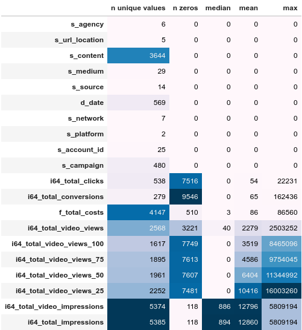
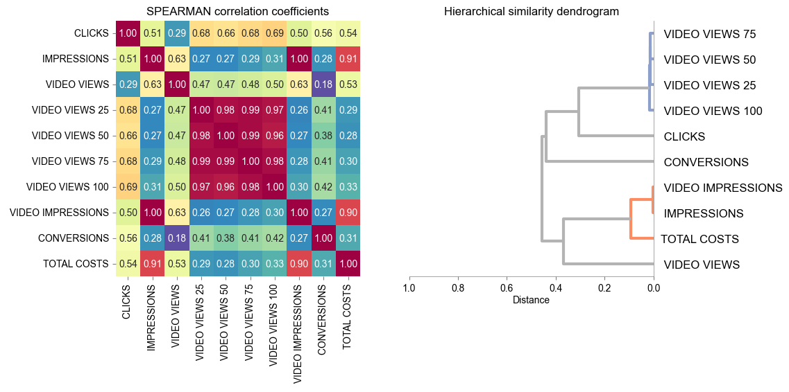
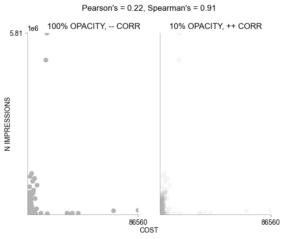
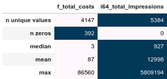
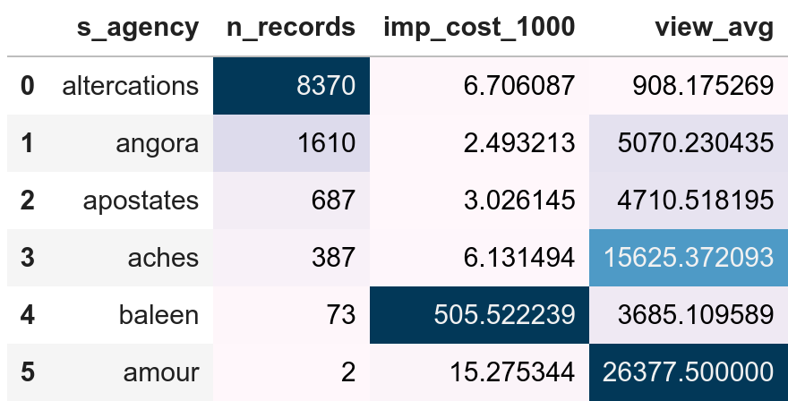
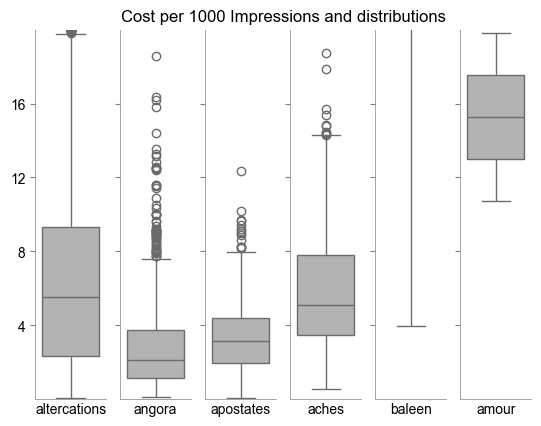
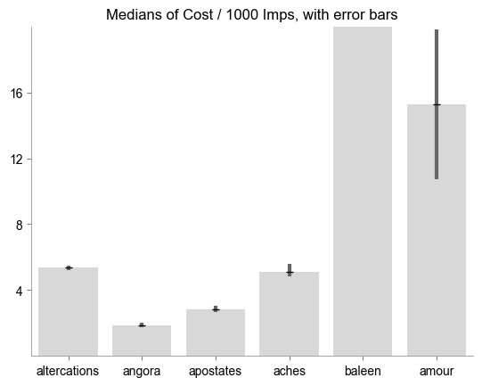

# SETUP:
We are looking for effective marketing agencies to manage our next social media campaign. To decide this, we are provided with a dataset hosted as a BigQuery table.

# SOLUTION:
Calculating a few summaries for each column of the dataset:

Based on this summary:
- There are 6 agencies of interest
- `(Video) Impressions` and `Costs` data have the least zero values, which means they are the most reliable metrics
- There seem to be distinct groups of data forming, e.g. `Video Views` of any percentage + `Clicks` OR `Impressions` + `Video Impressions`
- Based on the attrition of nonzero values, a path taken by users between select variables may be `(Video) Impressions` --> `Views 25` --> `Views 50` --> `Views 75` --> `Views 100`
- We can't be sure that records have the same data collection methods. Null values may already be replaced with 0s

It is helpful to assess cross-correlations of any numerical variables:

- `Conversions` attempts to measure users that the ads have converted into customers. This is what we are most interested in
- However, `Conversions` is difficult to use as a metric when most its values in the dataset are 0 and it is unexpectedly uncorrelated with the other variables
- We could select a nonzero subset and compare the agencies for their average conversions, although this adjustment assumes zero values are invalid datapoints, when they might be unsuccessful campaigns
- `Cost / 1000_Impressions` can be a better metric measuring agency success. It measures outreach rather than the success of each advertisement
- Average clicks can be a second, less reliable metric due to most values being 0, that valuably measures engagement

Let's compare Costs with Impressions:

- Pearson's (linear) correlation is skewed by influential outliers, when there is a clear correlation. Hence we're using Spearman's (rank) correlation
- Confirms `Cost / 1000_Impressions` as a potential metric, although Impressions must not be zero which it is for 118 values

We shouldn't delete datapoints, but we should roughly check that these 0 values belong to the same distribution:

- The descriptive values shift slightly in the positive direction, which is to be expected when 0 values are deleted 
- We should then keep these 0 values with the new metric being `Cost / (1000_Impressions + 1)`

After assigning arbitrary English names to each agency, we can assess how each agency does on our metric:

- We probably cannot trust the values of `baleen` and `amour`, as there are too few records
- There is great variability and little concordance with the more reliable `imp_cost_1000` metric regarding `view_avg`
- `imp_cost_1000` is the main metric I will use to compare the agencies

When we draw a boxplot to assess the distribution:

- `angora` is looking like the most cost effective marketing agency when looking at outreach

Assuming these series are samples from an underlying distribution, it is worthwhile checking if the medians are statistically different from each other:

- The bootstrapped 95% confidence intervals of the medians of the top 2 do not overlap with others
- `angora` is the most cost effective solution at with median `Cost per 1000 Impressions` at 1.86 (+- 0.14), followed by `apostates` at 2.8 (+0.3, -0.14), with `altercations` and `apostates` tied at third
- Means are different from medians: 1.9 != 2.5 and 2.8 != 3.0. This is because of large outliers that we could see in the opacity comparison graph
- `baleen` and `amour` have very unreliable cost efficiency estimates, so we are only picking among the top 4
#
# SELECTION: ANGORA